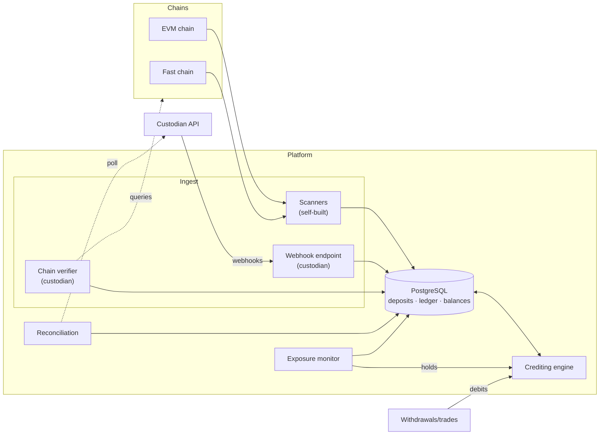

# Architecture

Service decomposition and data flows. Vocabulary: [../CONTEXT.md](../CONTEXT.md). Decisions: `docs/adr/`.

PostgreSQL is the durable pipeline. Recovery flows from sources of truth (chain rescan, custodian query API), never broker replay (ADR 0007).

## Components

| Component            | Responsibility                                                                           | Notes                                                   |
|----------------------|------------------------------------------------------------------------------------------|---------------------------------------------------------|
| **Scanner**          | Stream blocks, extract transfers, batch-resolve recipients, detect reorgs, advance depth | ~3K tx/block, ~100-500 MiB/process                      |
| **Webhook ingest**   | Receive custodian events, dedup by source ID, persist to `source_events`                 | Vault balance events → reconciliation only (ADR 0004)   |
| **Chain verifier**   | Confirm custodian claims on-chain, measure depth, re-check until finalized               | Platform measures depth; webhook is hint (ADR 0004)     |
| **Crediting engine** | Run state machine, atomic credit (state + ledger + balance)                              | Sole ledger writer, per-`(account,asset)` serialization |
| **Reconciliation**   | Poll custodian API for missed webhooks, compare vault vs ledger totals                   | Completeness backstop, never credit trigger             |
| **Exposure monitor** | Track unfinalized spendable value vs `E_max`, alert/hold at cap                          | Crediting never blocked (risk-policy §4)                |

External debits (withdrawals, trades) call the crediting engine's transactional interface, never write ledger directly (ADR 0003).

## Data Flows

**Self-built**: Chain → scanner → `PENDING` → depth advances → `N_credit`: atomic (state + ledger + balance) → `N_finalize`: `FINALIZED`

**Custodian**: Event → webhook → verifier confirms on-chain → `PENDING` → depth/crediting as above → re-checker watches until `FINALIZED`

**Reorg**: Parent/hash mismatch → rewind → deposits `REORGED` → rescan: re-included → `PENDING`, invalid past window → `REVERSED` with compensating entry (ADR 0002)

**Missed webhook**: Reconciliation poll → custodian API → same verified pipeline

## Storage

- **PostgreSQL**: append-only `source_events` + `ledger_entries`; projections in `deposits` + `account_balances`; identity via unique constraints
- **No broker** (ADR 0007): `source_events` is audit trail, outbox-ready if broker added
- **Optional**: LRU address cache, Bloom filter (~6-9 MiB @ 5M addresses), confirmed against PostgreSQL
- **Payloads**: versioned Go structs as `jsonb`, expand-and-contract evolution

## Deployment

Stateless replicas; correctness at DB boundary. Zero-downtime: additive schema → code tolerates both → migrate → remove old schema.
