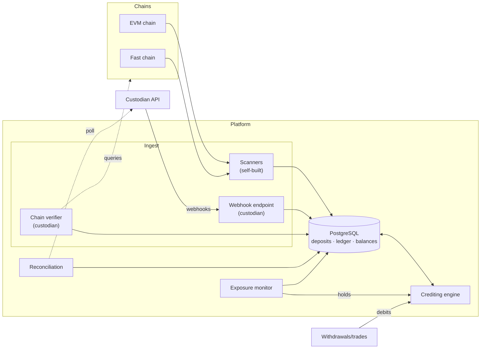

# Architecture

Service decomposition and data flows. Vocabulary: [../CONTEXT.md](../CONTEXT.md). Decisions: `docs/adr/`.

PostgreSQL is the durable pipeline. Recovery flows from sources of truth (chain rescan, custodian query API), never broker replay (ADR 0007).

## Processes

| Process                     | Cardinality            | Responsibilities                                                                         |
|-----------------------------|------------------------|------------------------------------------------------------------------------------------|
| **server** (`cmd/server`)   | N replicas (stateless) | Custodian webhook endpoint, debit API, query endpoints                                   |
| **scanner** (`cmd/scanner`) | 1 per chain            | Self-built deposit detection, inline reorg handling, confirmation depth advancement      |
| **worker** (`cmd/worker`)   | 1+ replicas            | Rechecker (custodian reorgs), reconciler + solvency, exposure monitor, invariant checker |

Chain client adapter (`internal/adapters`) abstracts node RPC for both scanner and custodian verification; custodian provider adapter abstracts webhook claims and API queries.

## Data Flows

**Self-built**: Chain → scanner → `CREATED` → `EventObserved` → `PENDING` → depth advances → `N_credit`: atomic (state + ledger + balance) → `N_finalize`: `FINALIZED`

**Custodian**: Event → webhook → verifier confirms on-chain → `CREATED` → `EventObserved` → `PENDING` → depth/crediting as above → re-checker watches until `FINALIZED`

**Reorg**: Parent/hash mismatch → rewind → deposits `REORGED` → rescan: re-included → `EventReincluded` → `PENDING`, invalid past window → `REVERSED` with compensating entry (ADR 0002)

**Missed webhook**: Reconciliation poll → custodian API → same verified pipeline

## Storage

- **PostgreSQL**: append-only `source_events` + `ledger_entries`; projections in `deposits` + `account_balances`; identity via unique constraints
- **No broker** (ADR 0007): `source_events` is audit trail, outbox-ready if broker added
- **Optional**: LRU address cache, Bloom filter (~6-9 MiB @ 5M addresses), confirmed against PostgreSQL
- **Payloads**: versioned Go structs as `jsonb`, expand-and-contract evolution

## Deployment

Stateless replicas; correctness at DB boundary. Zero-downtime: additive schema → code tolerates both → migrate → remove old schema.
