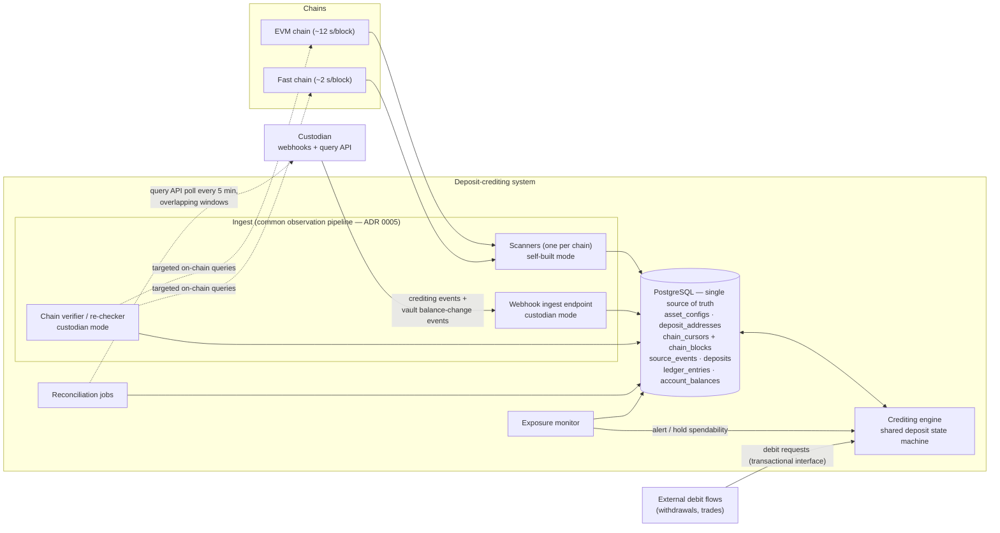

# Architecture

Service decomposition, data flows, and storage choices for the deposit-crediting system. Vocabulary: [../CONTEXT.md](../CONTEXT.md). Decisions: `docs/adr/`.

## Overview

No message broker: PostgreSQL is the durable pipeline, and recovery flows from sources of truth — chain rescan and the custodian query API — never from broker replay (ADR 0007).

## Components

| Component | Responsibility | Notes |
|---|---|---|
| **Scanner** (per chain) | Stream blocks; extract candidate native transfers + token logs; batch-resolve recipients against `deposit_addresses`; persist observations; advance the durable cursor; detect reorgs (parent/hash mismatch) and replay the replacement branch; advance confirmation depth of watched deposits | Streams bounded batches (~3,000 tx/block); ~100–500 MiB per process. Reorg window retained in `chain_blocks` |
| **Webhook ingest** | Receive custodian events; persist raw envelopes to `source_events`; dedup by source event ID; normalize crediting events into deposit observations | Both event types land here; **vault balance-change events go to reconciliation only** — they are aggregate and unattributed (ADR 0004) |
| **Chain verifier / re-checker** | Open deposits from verified custodian crediting events: targeted on-chain queries confirm the transfer and measure depth. Re-checks credited-but-unfinalized custodian deposits until the finality horizon | The platform measures confirmation depth itself; the webhook is only a hint (ADR 0004) |
| **Crediting engine** | Runs the shared deposit state machine; executes the credit transition as one transaction: state + ledger entry + balance projection (ADR 0003) | Sole writer of the ledger; per-`(account, asset)` serialization; optimistic conditional updates for platform hot accounts |
| **Reconciliation jobs** | Poll the custodian query API (5-min overlapping windows) for missed webhooks; compare vault balance-change events against per-asset ledger totals (solvency) | Completeness backstop, never a credit trigger |
| **Exposure monitor** | Tracks total unfinalized spendable credited value against `E_max`; alerts near the cap, holds spendability of new credits at/over it | Crediting itself is never blocked — the ledger must reflect chain facts (risk-policy §4) |

External debit flows (withdrawals, trades) call the crediting engine's transactional interface; they never write ledger tables directly (ADR 0003).

## Data flows

**Self-built deposit.** Chain → scanner → matched transfer persisted (`deposits`, state `PENDING`) → each new canonical block advances depth → at `N_credit`, one transaction: state `CREDITED` + ledger credit + balance update → at `N_finalize`, `FINALIZED`.

**Custodian deposit.** Crediting event → webhook ingest → `source_events` (dedup) → verifier confirms the transfer on-chain and attributes it via our own address table → deposit opens as `PENDING` → depth and crediting as above → re-checker watches until `FINALIZED`.

**Reorg.** Scanner hits a parent/hash mismatch → rewinds into the retained window → affected deposits become `REORGED` → rescan of the replacement branch returns re-included transfers to `PENDING`; credited transfers that stay invalid become `REVERSED` with a compensating ledger entry (ADR 0002).

**Missed webhook.** Reconciliation poll finds the deposit via the custodian query API → enters the same verified pipeline. The scanner watching custodian addresses is a deferred option (ADR 0004).

## Storage choices

- **PostgreSQL for everything durable.** Append-only `source_events` and `ledger_entries`; current-state projections in `deposits` and `account_balances`; identity enforced by unique constraints (source event ID, logical transfer ID, `(chain, address)`). Table roles and sizing: [../technical-decisions.md](../technical-decisions.md) §PostgreSQL Shape and §Capacity Estimation.
- **No broker** (ADR 0007). `source_events` doubles as the audit trail and is outbox-ready if a broker is ever introduced.
- **Optional in-memory accelerants:** LRU address cache; Bloom pre-filter (~6–9 MiB at 5M addresses). Positives always confirmed against PostgreSQL.
- **Payloads we own:** versioned Go structs persisted as `jsonb`, evolved by expand-and-contract — no schema registry (ADR 0007).

## Deployment

Stateless replicas behind a load balancer; correctness lives at the database boundary, so replicas need no coordination. Zero-downtime releases via expand-and-contract: additive schema first, code tolerating both representations, migrate, then remove the old schema after old workers are gone.
