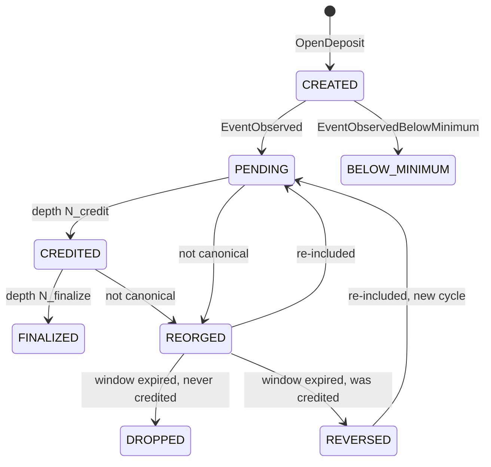

# Deposit State Machine

One shared machine for both crediting modes (ADR 0005). States track **logical transfer IDs** (ADR 0001). Canonical definitions: [../CONTEXT.md](../CONTEXT.md).

## Key Decisions

**One machine for both modes.** Reorg semantics, idempotent crediting, and reversal handling are chain/ledger properties, not detection-method properties. Two machines would duplicate correctness invariants. Mode-specific concerns (webhook delays, reconciliation) live outside the state machine (ADR 0005).

**REORGED ≠ REVERSED.** `REORGED` is an observation (left canonical chain), not a money movement. Transfers can be reorged while `PENDING` (never credited) or `CREDITED`. `REVERSED` only happens when a credited transfer stays invalid past the reorg window, triggering a compensating ledger entry.

**BELOW_MINIMUM is terminal.** Users can send sub minimum on-chain; we observe but don't credit.

**FINALIZED stops watching.** After `N_finalize` (far deeper than `N_credit`), the system stops checking canonical inclusion. Accepts residual risk: a reorg deeper than `N_finalize` could leave a credit in place. Trade-off is bounded monitoring cost vs unbounded protection; an exposure cap on aggregate unfinalized value bounds the financial risk (ADR 0002, ADR 0006).

## Invariants

- **No duplicate credit**: one row per logical transfer ID; ledger credit carries a unique reference (ADR 0001)
- **No missed credit**: every supported transfer opens a deposit; reconciliation backstops webhooks (ADR 0004)
- **No credit survives reorg — within horizon**: `CREDITED` is non-terminal until `N_finalize`; reversal is a compensating entry, never an edit (ADR 0002). After `FINALIZED`, the system stops watching (residual risk accepted)
- **Negative balance allowed**: reversal after spending may go negative; the account can be flagged, debits blocked (ledger concern, not deposit state)
- **Spendability separate**: `CREDITED` deposit may have holds (large-tier policy, exposure cap)

Terminal states: `FINALIZED`, `DROPPED`, `BELOW_MINIMUM`, `REVERSED` (re-inclusion from `REVERSED` starts new cycle at `PENDING`).
