# Deposit State Machine

One shared machine for both crediting modes (ADR 0005). States are per **logical transfer ID** (ADR 0001). Canonical definitions: [../CONTEXT.md](../CONTEXT.md).

```mermaid
stateDiagram-v2
    [*] --> PENDING: supported-asset transfer observed (scanner block / verified custodian claim)
    [*] --> BELOW_MINIMUM: under configured minimum

    PENDING --> CREDITED: confirmation depth N_credit reached
    CREDITED --> FINALIZED: finality horizon N_finalize passed

    PENDING --> REORGED: inclusion no longer canonical
    CREDITED --> REORGED: inclusion no longer canonical
    REORGED --> PENDING: re-included on canonical chain
    REORGED --> DROPPED: never credited; reorg window expired
    REORGED --> REVERSED: was credited; compensating entry written
    REVERSED --> PENDING: re-included later; new credit cycle
```

## Transitions

| From | To | Condition | Driven by | Ledger effect |
|---|---|---|---|---|
| — | `PENDING` | Supported-asset transfer at/above minimum observed on a candidate chain | scanner / chain verifier | none |
| — | `BELOW_MINIMUM` | Observed transfer under the configured minimum | scanner / chain verifier | none — terminal |
| `PENDING` | `CREDITED` | Confirmation depth `N_credit` reached on the canonical chain | depth advancement (new blocks / re-checker) | **credit + balance update, same transaction** |
| `CREDITED` | `FINALIZED` | Finality horizon `N_finalize` passed; system stops watching | depth advancement | none — terminal |
| `PENDING` | `REORGED` | Inclusion no longer canonical (parent/hash mismatch) | reorg detection | none |
| `CREDITED` | `REORGED` | Inclusion no longer canonical | reorg detection | none *yet* |
| `REORGED` | `PENDING` | Transfer re-included on the canonical chain | rescan of replacement branch | none |
| `REORGED` | `DROPPED` | Never credited, and the reorg window expired without re-inclusion | reorg sweeper | none — terminal |
| `REORGED` | `REVERSED` | Was credited; transfer invalid or absent past the reorg window | reorg sweeper | **compensating reversal entry** — terminal for this credit cycle |
| `REVERSED` | `PENDING` | The same logical transfer is re-included later | scanner / chain verifier | none — a **new** credit cycle begins |

## Terminal states

`FINALIZED`, `DROPPED`, `BELOW_MINIMUM`, and `REVERSED` (terminal for that credit cycle — re-inclusion starts a new cycle at `PENDING`, never resurrects the old one).

## Invariants and notes

- **No duplicate credit:** one row per logical transfer ID; the ledger credit carries a unique reference to it (ADR 0001).
- **No missed credit:** every observed supported transfer opens a deposit; reconciliation backstops missed webhooks (ADR 0004).
- **No credit survives a reorg — within the observation horizon:** `CREDITED` is non-terminal until the finality horizon; reversal is a compensating entry, never an edit (ADR 0002). The guarantee is explicitly bounded: after `FINALIZED` the system stops watching, so a reorg deeper than `N_finalize` can leave a credit in place. That residual risk is accepted and priced by the exposure model ([risk-policy.md](risk-policy.md) §2), not eliminated.
- `REORGED` is an observation state, not a money movement by itself.
- A reversal the user already spent may drive the balance negative: the account is flagged and further debits blocked. That is a ledger/account concern, deliberately **not** a deposit state.
- Spendability is a separate axis from these states: a deposit can be `CREDITED` while a hold (large-tier policy, exposure cap) keeps part of it non-spendable.
- `N_credit` / `N_finalize` values per chain: [risk-policy.md](risk-policy.md) §5.

## Why one shared machine

Reorg semantics, idempotent crediting, and reversal handling are properties of chain facts and the ledger, not of who detected the deposit. Two machines would mean implementing, testing, and monitoring every correctness invariant twice (ADR 0005). Mode-specific concerns — provider delays, missed webhooks, book discrepancies — live in reconciliation jobs and hold flags, outside the machine.
